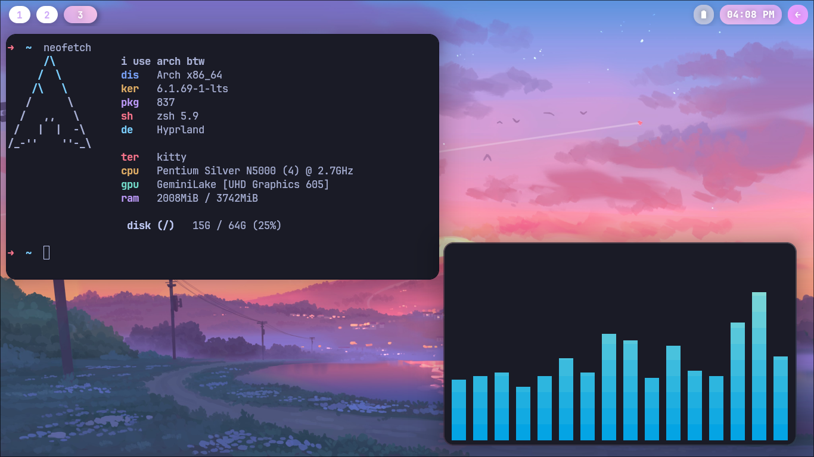

<div align="justify">
<div align="center">

```
soothing arch linux rice
```


<details>
<summary>Info</summary>

WM: [Hyprland](https://hyprland.org)<br>
FM: [nemo](https://github.com/linuxmint/nemo)<br>
Launcher: [wofi](https://github.com/uncomfyhalomacro/wofi)<br>
Terminal: [kitty](https://sw.kovidgoyal.net/kitty/)<br>
Shell: [zsh](https://www.zsh.org/) with [ohmyzsh](https://github.com/ohmyzsh/ohmyzsh)<br>
Bar: [waybar](https://github.com/Alexays/Waybar)<br>
Notification: [swaync](https://github.com/ErikReider/SwayNotificationCenter)<br>
</details>

# gallery




<hr>

# dependencies

Make sure that you have [yay](https://github.com/Jguer/yay) installed.

```ocaml
yay -S hyprland-git lxappearance thunar wofi kitty bibata-cursor-theme catppuccin-gtk-theme-mocha nvim ttf-jetbrains-mono-nerd papirus-icon-theme pavucontrol brightnessctl zsh swaync noto-fonts noto-fonts-cjk noto-fonts-extra
```

# install

Just copy .config to ~/.config, and .zshrc to ~/.

<details>
<summary>Setting themes</summary>
<br>

Open lxappearance, then set the theme (personally I use the sapphire one).
Also set the cursor to Bibata.

Since lxappearance doesn't modify the gtk config, we are going to do it manually.<br>
Open `nvim ~/.config/gtk-3.0/settings.ini`, and change gtk-cursor-theme-name to the one you selected in lxappearance.

**IMPORTANT** also change the gtk configs in /usr/share/gtk-2.0 (and 3.0)
For gtk-3.0 it's settings.ini, gtk-2.0 would be gtkrc.

If your browser (e.g Chromium) isn't respecting your cursor theme, **open ~/.icons/default/index.theme then change the `Inherits` key to the cursor theme you selected in lxappearance.**

</details>
<div align="justify">
<div align="left">

# credits

[PROxZIMA](https://github.com/PROxZIMA/.dotfiles/)<br>
[flick0](https://github.com/flick0/dotfiles/tree/dreamy)<br>
bg from : [here](https://photos.google.com/share/AF1QipOtA42jn_ReuQVv8uVXpWl0PNjhXRw7e_EGUT3m-2wOVUUfDsX1OUvm5c8_GL2gvg/photo/AF1QipNlV9LJZB-c9sMAILaeSaKYI_uYn41thkw9IJaG?key=SUxqZ1BMSVVUdjJjbk1DSzZwZ0VEenpxQk1nM3p3)
